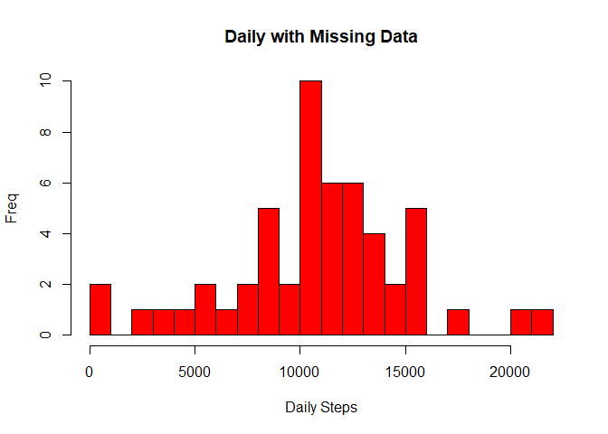

                                      Reproducible Data Project Week 2 Project 1

Author: "David Redman"

Date: "5/25/2020"


---

The data for this assignment was downloaded from the course web site:

- Dataset: Activity monitoring data [52K], https://d396qusza40orc.cloudfront.net/repdata%2Fdata%2Factivity.zip

The variables included in this dataset are:

- steps: Number of steps taking in a 5-minute interval (missing values are coded as NA\color{red}{\verb|NA|} NA)

- date: The date on which the measurement was taken in YYYY-MM-DD format

- interval: Identifier for the 5-minute interval in which measurement was taken

The dataset is stored in a comma-separated-value (CSV) file and there are a total of 17,568 observations in this dataset.


Load the assignment data


```r
setwd("C:/")
setwd("C:/Users/chris/Desktop/Coursera/ReproducibleDataProj1")

a <- read.csv("activity.csv", header = TRUE, na.strings = "NA")

library(dplyr)
```

```
## Warning: package 'dplyr' was built under R version 3.6.3
```

```
## 
## Attaching package: 'dplyr'
```

```
## The following objects are masked from 'package:stats':
## 
##     filter, lag
```

```
## The following objects are masked from 'package:base':
## 
##     intersect, setdiff, setequal, union
```

```r
library(ggplot2)
```

```
## Warning: package 'ggplot2' was built under R version 3.6.3
```

inspect the data set structure, summary, head, and tail


```r
str(a)
```

```
## 'data.frame':	17568 obs. of  3 variables:
##  $ steps   : int  NA NA NA NA NA NA NA NA NA NA ...
##  $ date    : Factor w/ 61 levels "2012-10-01","2012-10-02",..: 1 1 1 1 1 1 1 1 1 1 ...
##  $ interval: int  0 5 10 15 20 25 30 35 40 45 ...
```

```r
summary(a)
```

```
##      steps                date          interval     
##  Min.   :  0.00   2012-10-01:  288   Min.   :   0.0  
##  1st Qu.:  0.00   2012-10-02:  288   1st Qu.: 588.8  
##  Median :  0.00   2012-10-03:  288   Median :1177.5  
##  Mean   : 37.38   2012-10-04:  288   Mean   :1177.5  
##  3rd Qu.: 12.00   2012-10-05:  288   3rd Qu.:1766.2  
##  Max.   :806.00   2012-10-06:  288   Max.   :2355.0  
##  NA's   :2304     (Other)   :15840
```

```r
#Number of "NA" rows in the data set
nrow(a[!complete.cases(a),])
```

```
## [1] 2304
```

```r
head(a,3)
```

```
##   steps       date interval
## 1    NA 2012-10-01        0
## 2    NA 2012-10-01        5
## 3    NA 2012-10-01       10
```

```r
tail(a,3)
```

```
##       steps       date interval
## 17566    NA 2012-11-30     2345
## 17567    NA 2012-11-30     2350
## 17568    NA 2012-11-30     2355
```

Preparation of the data for analysis


```r
a$date <- as.Date(a$date)
a$weekend <- as.factor(ifelse(weekdays(a$date)=="Saturday" | weekdays(a$date)=="Sunday","weekend","weekday"))
a$weekday <- as.factor(weekdays(a$date))
str(a)
```

```
## 'data.frame':	17568 obs. of  5 variables:
##  $ steps   : int  NA NA NA NA NA NA NA NA NA NA ...
##  $ date    : Date, format: "2012-10-01" "2012-10-01" ...
##  $ interval: int  0 5 10 15 20 25 30 35 40 45 ...
##  $ weekend : Factor w/ 2 levels "weekday","weekend": 1 1 1 1 1 1 1 1 1 1 ...
##  $ weekday : Factor w/ 7 levels "Friday","Monday",..: 2 2 2 2 2 2 2 2 2 2 ...
```

```r
names(a)
```

```
## [1] "steps"    "date"     "interval" "weekend"  "weekday"
```

```r
lapply(a, class)
```

```
## $steps
## [1] "integer"
## 
## $date
## [1] "Date"
## 
## $interval
## [1] "integer"
## 
## $weekend
## [1] "factor"
## 
## $weekday
## [1] "factor"
```


Assignment Question 1:


    What is mean total number of steps taken per day?

        1. Ignore the missing values in the dataset.

        2. Calculate the total number of steps taken per day

        3. Create a histogram of the "Total Number of Steps Taken Each Day"

        4. Calculate the mean of the total number of steps per day


```r
asteps <- tapply(a$steps, a$date, sum, na.rm= FALSE, simplify=TRUE)
asteps <- (asteps[!is.na(asteps)])
summary(asteps)
```

```
##    Min. 1st Qu.  Median    Mean 3rd Qu.    Max. 
##      41    8841   10765   10766   13294   21194
```


    -  The Mean is 10766
    
    -  The Median is 10765
    
    - Total Number of steps taken 21194


```r
hist(asteps,main = paste ("Total number taken per Day "), col="red", breaks=20, xlab = "Number of Steps")
```

<!-- -->


-  Calculate the mean of the total number of steps per day


```r
summary(asteps)
```

```
##    Min. 1st Qu.  Median    Mean 3rd Qu.    Max. 
##      41    8841   10765   10766   13294   21194
```

```r
# The mean is 10766 and the median is 10765
```


Assignment Question 2:

    What is the average daily activity pattern?
    
        1. Make a time series plot type = "l" of the 5-minute interval (x-axis) and the average number of steps 
        taken, averaged across all days (y-axis)
        
        2. Which 5-minute interval, on average across all the days in the dataset, contains the maximum number
        of steps?

```r
bsteps <- tapply(a$steps, a$interval, mean, na.rm=TRUE, simplify = TRUE)
avgsteps <- data.frame(interval=as.integer(names(bsteps)), avg=bsteps)

with(avgsteps,
     plot(interval,
          avg,
          type="l",
          main = "5 minute Intervals, Average Number of Steps",
          xlab="Intervals",
          ylab="Number of Steps")) 
```

<!-- -->

```r
filter(avgsteps,avg==max(avg)) 
```

```
##   interval      avg
## 1      835 206.1698
```

-  Max Steps in the 5 minute interval is 835

-  Average across all the days: 206.1695
      
 
 
Imputing missing values

Note: There are a number of days/intervals where there are missing values (coded as NA).  The presence of missing days may introduce bias into some calculations or summaries of the data. 

        1. Calculate and report the total number of missing values in the dataset i.e the total number of rows with
        NAs

```r
summary(a$steps)
```

```
##    Min. 1st Qu.  Median    Mean 3rd Qu.    Max.    NA's 
##    0.00    0.00    0.00   37.38   12.00  806.00    2304
```

```r
#Number of "NA" rows in the data set
nrow(a[!complete.cases(a),])
```

```
## [1] 2304
```

        2. Fill in all of the missing values in the dataset. For example, you could use the mean/median for that day,
        or the mean for that 5-minute interval, etc.
        
        3. Create a new dataset that is equal to the original dataset but with the missing data filled in.

        

```r
av <- a
avsteps <- is.na(asteps)
av_avg <-tapply(a$steps, a$interval, mean, na.rm= TRUE, simplify=TRUE)
av$steps[avsteps] <- av_avg[as.character(av$interval[avsteps])]
```


        4. Make a histogram of the total number of steps taken each day, Calculate, and report the mean and median
        total number of steps taken per day. Do these values differ from the estimates from the first part of the
        assignment?
        
        What is the impact of imputing missing data on the estimates of the total daily number of steps?


```r
csteps <- tapply(av$steps, av$date, sum, na.rm=FALSE, simplify=T)


hist(csteps,col="red", breaks=25, xlab="Daily Steps", ylab="Freq",
     main="Daily with Missing Data")    
```

<!-- -->

```r
#   -imputing the missing date lower the average number of steps,  center bar in histogram
```


Are there differences in activity patterns between weekdays and weekends?
 
    For this part the weekdays function may be of some help here. Use the dataset with the filled-in 
    missing values for this part.
    
    1. Create a new factor variable in the dataset with two levels – “weekday” and “weekend” indicating 
    whether a given date is a weekday or weekend day.

    2. Make a panel plot containing a time series plot type = "l" of the 5-minute interval (x-axis)
    and the average number of steps taken, averaged across all weekday days or weekend days (y-axis). 
    See the README file in the GitHub repository to see an example of what this plot should look like 
    using simulated data.
    

```r
csteps_wk <- aggregate(steps ~ a$weekday+interval, data=av, FUN=mean)

library(lattice)
xyplot(steps ~ interval | factor(a$weekend),
       layout = c(1, 2),
       xlab="Interval",
       ylab="Number of steps",
       type="l",
       lty=1,
       data=csteps_wk )
```

<!-- -->

There is a high activity of steps during the week, however, the weekend shorter period indicates that activity was more. 


